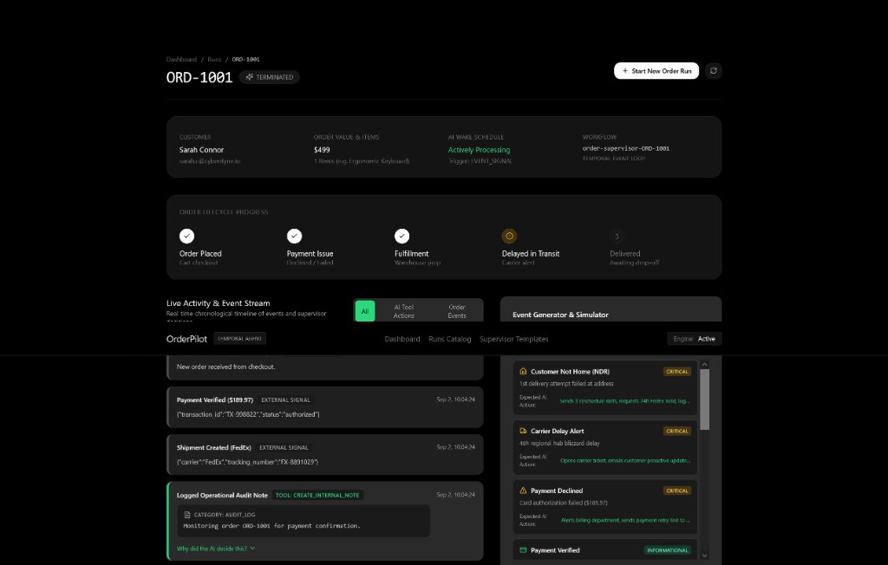
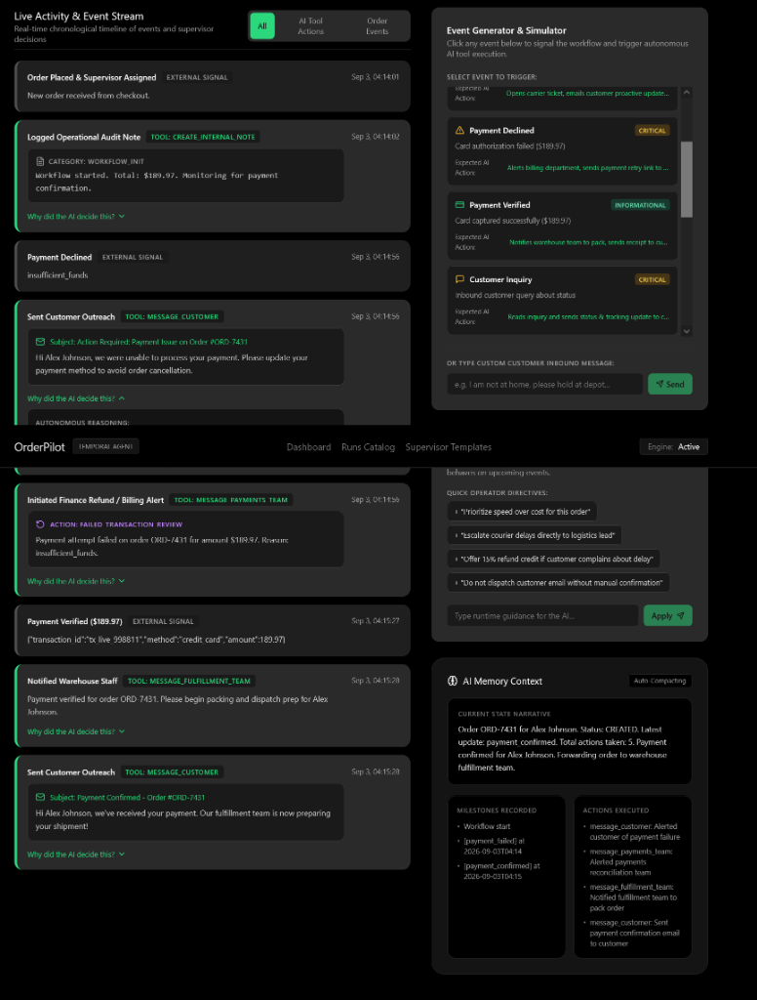
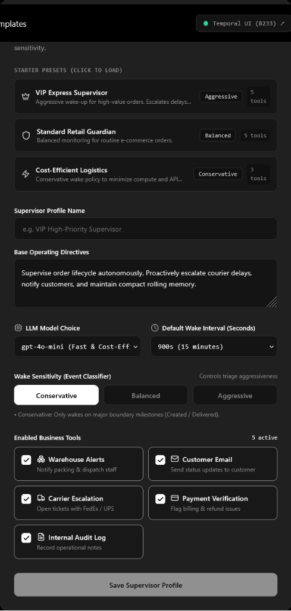
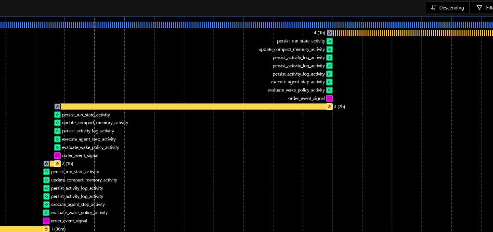

# Order Supervisor

A long-running order supervision platform built with Temporal, FastAPI, and Next.js. Each order runs as an isolated, persistent Temporal workflow that reacts to domain signals (payment verifications, courier tracking, carrier delays), executes business actions through tool activities, maintains rolling memory, and sleeps with zero CPU overhead when inactive.

---

## Interface & Workflow Control Room

### Order Control Room & Automated Autopilot
Tracks live order milestones, tool execution logs, and incoming event stream with automated 30-second lifecycle playback and manual event simulation.



### Agent Memory & Dynamic Operator Directives
Sliding-window memory summary, milestone history, and manual instruction injection to adjust agent behavior mid-flight.



### Supervisor Configuration Profiles
Configurable supervisor profiles with customizable wake sensitivity, sleep intervals, model selection, and tool permissions.



### Temporal Workflow Execution
Long-running workflow execution showing timer-based sleep cycles, signal triggers, and activity dispatches.



---

## Seeded Demo Order Catalog (14 Orders)

The database seed includes **14 pre-configured demo orders** (`ORD-1001` through `ORD-1014`) covering diverse operational scenarios:

- **`ORD-1001` (Sarah Connor)**: VIP Split Mechanical Keyboard ($499.00) - `VIP Supervisor` - Payment confirmed, rush fulfillment dispatched, dormant awaiting carrier scan.
- **`ORD-1002` (Marcus Vance)**: 49" Curved OLED Monitor ($1,199.00) - `VIP Supervisor` - Dispatched via FedEx Priority Overnight.
- **`ORD-1003` (Elena Rostova)**: Studio ANC Headphones ($349.50) - `Standard Retail` - In transit, active 48h blizzard delay alert logged, carrier ticket opened.
- **`ORD-1004` (David Kim)**: Custom PBT Keycaps ($129.00) - `Standard Retail` - Customer tracking inquiry auto-answered.
- **`ORD-1005` (Amara Okafor)**: Titanium Smart Ring ($299.00) - `Standard Retail` - 1st delivery attempt failed (NDR), 3 reschedule slots offered.
- **`ORD-1006` (Lucas Silva)**: USB-C Audio DAC ($189.97) - `Returns & Disputed` - Refund requested, fulfillment halted for billing review.
- **`ORD-1007` (Chloe Bennett)**: Ergonomic Vertical Mouse ($89.99) - `Standard Retail` - Delivered to front porch, terminal AI post-mortem report compiled.
- **`ORD-1008` (Liam Gallagher)**: 4K 144Hz Creator Display ($799.00) - `VIP Supervisor` - Delivered with signature confirmation.
- **`ORD-1009` (Sophia Martinez)**: Laptop Stand ($119.00) - `Returns & Disputed` - Cancelled pre-shipment, full refund issued.
- **`ORD-1010` (Noah Jensen)**: Thunderbolt 4 Dock ($249.00) - `Standard Retail` - Payment verified, warehouse packing.
- **`ORD-1011` (Zoe Chen)**: Desk Mat & Arm Rest ($68.50) - `Standard Retail` - Order placed, 15m payment watchdog timer armed.
- **`ORD-1012` (James Wilson)**: Enterprise GPU Enclosure ($1,450.00) - `VIP Supervisor` - Paused by operator for VAT address verification.
- **`ORD-1013` (Maya Patel)**: Executive Ergonomic Chair ($580.00) - `VIP Supervisor` - Freight delivery completed on schedule.
- **`ORD-1014` (Oliver Wright)**: Studio Isolation Pads ($54.00) - `Standard Retail` - Silent courier tracking (24h), carrier tracer ping sent.

---

## Core Mechanics

- **One Workflow per Order**: Orders are modeled as long-running Temporal workflows that persist until delivery, cancellation, or manual termination.
- **Automated Autopilot & Manual Simulation**:
  - **Autopilot (Default)**: Automatically advances the order through its lifecycle milestones with a 30-second interval (`payment_confirmed` -> `shipment_created` -> `shipment_delayed` -> `customer_message_received` -> `delivered`).
  - **Manual Mode**: Allows operators to pause automation with one click (`[ Manual ]`) and trigger individual events or inject custom inbound customer inquiries.
- **Event-Driven Wake/Sleep**: The workflow sleeps via Temporal timers (`workflow.wait_condition`). It wakes only when:
  1. The workflow first initializes (`WORKFLOW_START`)
  2. An incoming signal is received (`EVENT_SIGNAL` / `MANUAL_INSTRUCTION`)
  3. A scheduled timer fires (`SCHEDULED_TIMER`)
- **Two-Tier Wake Policy Classifier**: Evaluates event priority against the supervisor's sensitivity setting (Conservative, Balanced, Aggressive) to decide whether to trigger immediate agent inference or defer to scheduled wake.
- **Business Action Tools**:
  - `message_fulfillment_team`: Warehouse packing and dispatch alerts.
  - `message_payments_team`: Billing alerts, payment failures, and refunds.
  - `message_logistics_team`: Courier inquiries and carrier tickets.
  - `message_customer`: Customer transactional emails and delay updates.
  - `create_internal_note`: Audit notes and human review flags.
- **Dynamic Operator Steering**: Operators can signal runtime directives (e.g., *"For this order, prioritize speed over cost"*) that immediately update active memory context.
- **Terminal Post-Mortem Output**: When an order reaches completion (`delivered` or `refund_requested`), the agent compiles a structured final summary, list of actions taken, key learnings, and supply chain recommendations.

---

## Project Structure

```text
order-supervisor/
├── apps/
│   ├── web/                    # Next.js 14 frontend (App Router, Tailwind CSS)
│   │   ├── app/                # Pages: dashboard, runs catalog, supervisor profiles
│   │   └── components/runs/    # Feed, timeline, controls, autopilot simulator
│   └── api/                    # FastAPI backend
│       ├── app/api/routes/     # REST endpoints for runs, events, instructions, supervisors
│       ├── app/models/         # SQLAlchemy models (runs, events, activities, supervisors)
│       └── app/services/       # Temporal client wrapper and orchestration logic
├── temporal/
│   ├── workflows/              # OrderSupervisorWorkflow implementation & state
│   ├── activities/             # Agent evaluation, wake classifier, memory compaction
│   └── tools/                  # Business action tool activities
├── domain/                     # Shared models, enums, and schemas
├── database/                   # Seed script and SQLite / PostgreSQL schema
├── tests/
│   ├── unit/                   # Wake policy, memory compaction, and tool tests
│   ├── workflows/              # End-to-end Temporal workflow integration tests
│   └── api/                    # REST API tests and Schemathesis property fuzzing
└── scripts/                    # Event injection CLI, launch scripts, and database reset
```

---

## Quick Start (Local Setup)

### 1. Installation
Clone the repository and install dependencies:

```bash
# 1. Setup Python virtual environment
python -m venv .venv
.\.venv\Scripts\Activate.ps1   # On macOS/Linux: source .venv/bin/activate
pip install -r requirements.txt

# 2. Setup Frontend dependencies
cd apps/web
npm install
cd ../..

# 3. Seed database with 14 demo orders
python database/seed.py
```

### 2. Run the Stack (1-Click Launcher)

**Windows PowerShell:**
```powershell
.\scripts\start-local.ps1
```

**macOS / Linux:**
```bash
bash scripts/start-local.sh
```

### 3. Service Dashboard Endpoints
- **Next.js Web Frontend**: [http://localhost:3000](http://localhost:3000)
- **FastAPI REST API Docs**: [http://127.0.0.1:8000/docs](http://127.0.0.1:8000/docs)
- **Temporal Web Console**: [http://localhost:8233](http://localhost:8233)

---

## Verification & Automated Testing

Run the full automated test suite (32 tests):

```bash
pytest tests
```
