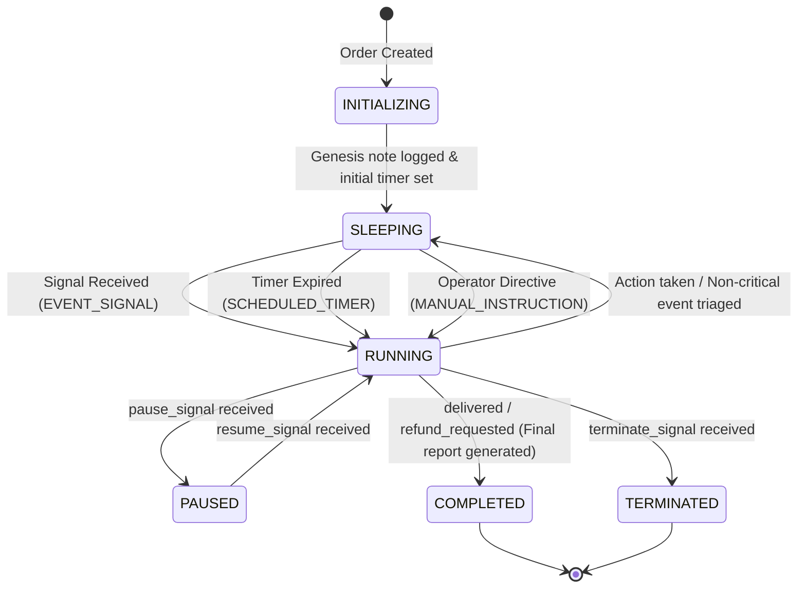

# Order Supervisor: Technical Architecture & System Design

## 1. System Overview & Durable Execution Model

Order Supervisor is an autonomous operations platform designed to oversee the lifecycle of an e-commerce order from creation until terminal completion.

Traditional architectures rely either on high-frequency cron polling or stateless webhook handlers. In contrast, this platform models each order as a persistent, long-running Temporal workflow execution (`order-supervisor-{order_id}`).

```
+---------------------------------------------------------------------------------------+
|                                    Next.js 14 UI                                      |
|            Operator Cockpit, 30s Autopilot Simulator, Profile Configuration           |
+---------------------------------------------------------------------------------------+
                                           |
                                           | HTTP REST
                                           v
+---------------------------------------------------------------------------------------+
|                                    FastAPI Backend                                    |
|               API Gateway, Signal Dispatcher, Run State & Control Plane               |
+---------------------------------------------------------------------------------------+
                                           |
                                           | gRPC (Port 7233)
                                           v
+---------------------------------------------------------------------------------------+
|                              Temporal Workflow Engine                                 |
|                                                                                       |
|  OrderSupervisorWorkflow (temporal/workflows/order_supervisor.py)                     |
|  - Deterministic state machine (INITIALIZING -> SLEEPING <-> RUNNING -> COMPLETED)    |
|  - Signal handlers: order_event_signal, instruction_signal, pause/resume/terminate    |
|  - Sleep management: workflow.wait_condition with deterministic timer                 |
|  - History compaction: workflow.continue_as_new                                       |
+---------------------------------------------------------------------------------------+
              |                                                   |
              | Schedules Activities                              | Persists
              v                                                   v
+-------------------------------------------+   +---------------------------------------+
|              Worker Process               |   |           Database Storage            |
|                                           |   |         (PostgreSQL / SQLite)         |
| 1. evaluate_wake_policy_activity          |   |                                       |
| 2. execute_agent_step_activity            |-->| - runs (state, memory, final_output)  |
| 3. Business Action Tools (5 modules)      |   | - events (raw domain signal history)  |
| 4. update_compact_memory_activity         |   | - activities (agent reasoning & tools)|
| 5. persist_run_state_activity             |   | - supervisors (profile presets)       |
+-------------------------------------------+   +---------------------------------------+
```

### Key Architectural Guarantees:
- **Durable Lifecycle State**: Workflow state survives server restarts, process crashes, and network partitions without losing variables, timers, or execution history.
- **Zero-CPU Dormancy**: Between events, the agent remains completely dormant using Temporal timers (`workflow.wait_condition`), consuming 0 tokens and 0% CPU.
- **Event-Driven Reactivity**: Incoming domain signals immediately wake the workflow to evaluate operational risk and take corrective actions.
- **Dual Simulation Modes**: Supports automated 30-second milestone lifecycle playback by default alongside interactive manual signal injection.

---

## 2. Temporal State Machine & Signal Interface

### State Machine Lifecycle



### Signal & Query Interface Definitions

| Handler Type | Method Name | Payload Contract | Description |
| :--- | :--- | :--- | :--- |
| `@workflow.signal` | `order_event_signal` | `DomainEvent(type, payload, source)` | Delivers domain events (e.g., `payment_confirmed`, `shipment_delayed`). |
| `@workflow.signal` | `instruction_signal` | `{"instruction": str, "added_at": str}` | Injects live human operator directives into the agent context. |
| `@workflow.signal` | `pause_signal` | `None` | Suspends event processing and sets workflow status to `PAUSED`. |
| `@workflow.signal` | `resume_signal` | `None` | Resumes a paused workflow back to `RUNNING` / `SLEEPING`. |
| `@workflow.signal` | `terminate_signal` | `{"reason": str}` | Immediately concludes the workflow and persists terminal state. |
| `@workflow.query` | `get_current_state` | `None` | Synchronously returns current memory, status, and wake timer without blocking. |

---

## 3. Two-Tier Event Triage Policy

To optimize LLM token consumption and avoid unneeded activity invocations on routine pings, incoming events pass through a lightweight classifier (`temporal/activities/wake_policy.py`) before invoking the cognitive agent:

```
[Inbound Event Signal] 
         │
         ▼
[evaluate_wake_policy_activity] 
         │
    ┌────┴───────────────────────────┐
    │                                │
[CRITICAL / ACTIONABLE]       [INFORMATIONAL]
    │                                │
    ▼                                ▼
[execute_agent_step_activity]    [Defer to Next Scheduled Wake /
(Wake agent, call tools,          Record event in memory silently]
 update memory & timeline)
```

### Event Priority & Sensitivity Matrix

| Event Type | Priority Tier | Reaction in Balanced Mode | Reaction in Conservative Mode | Reaction in Aggressive Mode |
| :--- | :--- | :--- | :--- | :--- |
| `payment_failed` | Critical | Wake immediately | Wake immediately | Wake immediately |
| `shipment_delayed` | Critical | Wake immediately | Wake immediately | Wake immediately |
| `refund_requested` | Critical | Wake immediately | Wake immediately | Wake immediately |
| `customer_message_received` | Critical | Wake immediately | Wake immediately | Wake immediately |
| `delivery_attempt_failed` | Critical | Wake immediately | Wake immediately | Wake immediately |
| `no_update_for_n_hours` | Critical | Wake immediately | Wake immediately | Wake immediately |
| `manual_instruction` | Critical | Wake immediately | Wake immediately | Wake immediately |
| `payment_confirmed` | Informational | Wake (advances to packing) | Defer to scheduled wake | Wake immediately |
| `shipment_created` | Informational | Wake (records tracking) | Defer to scheduled wake | Wake immediately |
| `delivered` | Terminal | Wake immediately (completes) | Wake immediately (completes) | Wake immediately (completes) |

---

## 4. Agent Runtime & Business Action Tools

When the workflow triggers `execute_agent_step_activity`, the agent analyzes the order context, active memory, and incoming triggers to execute one or more tools:

```
+--------------------------------------------------------------------------------+
|                          execute_agent_step_activity                           |
|                                                                                |
|  Input: { order_context, current_memory, trigger_event, active_instructions }  |
|                                                                                |
|  Reasoning Engine:                                                             |
|  1. Evaluates situational risk & milestones                                    |
|  2. Ingests operator guidance directives                                       |
|  3. Synthesizes step-by-step reasoning trace                                   |
|  4. Calls specialized business tools                                           |
+--------------------------------------------------------------------------------+
        │                   │                   │                   │
        ▼                   ▼                   ▼                   ▼
[Fulfillment Tool]   [Payments Tool]    [Logistics Tool]    [Customer Tool]
  Warehouse pack &     Decline review &    Carrier ticket &    Proactive email &
  dispatch alerts      refund tickets      depot hold ping     status tracking
```

### Tool Inventory & Module Paths

1. **`message_fulfillment_team`** ([`temporal/tools/fulfillment.py`](file:///d:/projects/order-supervise/temporal/tools/fulfillment.py)):
   - Dispatches priority warehouse packing tickets and hold notices.
2. **`message_payments_team`** ([`temporal/tools/payments.py`](file:///d:/projects/order-supervise/temporal/tools/payments.py)):
   - Alerts billing on payment declines, charge disputes, and authorizes return refunds.
3. **`message_logistics_team`** ([`temporal/tools/logistics.py`](file:///d:/projects/order-supervise/temporal/tools/logistics.py)):
   - Opens courier escalation tickets with FedEx, UPS, DHL, or Royal Mail for bottlenecks and delivery holds.
4. **`message_customer`** ([`temporal/tools/customer.py`](file:///d:/projects/order-supervise/temporal/tools/customer.py)):
   - Sends transactional emails, delay advisories, and reschedule links directly to the customer.
5. **`create_internal_note`** ([`temporal/tools/internal_note.py`](file:///d:/projects/order-supervise/temporal/tools/internal_note.py)):
   - Records structured operational audit entries (`logistics_incident`, `workflow_init`, `staleness_check`).

---

## 5. Memory Architecture & Rolling Compaction

To ensure that long-running workflows spanning days or weeks do not exceed LLM context windows or database payload limits, the system maintains a compact, structured memory schema ([`temporal/activities/memory.py`](file:///d:/projects/order-supervise/temporal/activities/memory.py)):

```json
{
  "order_id": "ORD-1001",
  "current_status": "PROCESSING",
  "payment_status": "CONFIRMED",
  "shipment_status": "IN_TRANSIT",
  "summary": "VIP order initialized. Payment captured and parcel dispatched via FedEx Priority. Dormant in scheduled sleep awaiting next carrier waypoint scan.",
  "key_events_summary": [
    "order_created: Initialized at checkout",
    "payment_confirmed: Captured $499.00 via Stripe (tx_998811)",
    "shipment_created: Dispatched via FedEx tracking FX-99881122"
  ],
  "actions_taken": [
    "Notified warehouse team [RUSH PRIORITY]",
    "Sent payment confirmation receipt to customer",
    "Dispatched shipping tracking link FX-99881122"
  ],
  "last_updated_at": "2026-09-03T10:15:00Z"
}
```

### Compaction Mechanics:
- **Order Header**: Preserves immutable metadata (order ID, customer email, order value, SKU).
- **Milestones Array**: Chronologically retains key domain state transitions.
- **Rolling Narrative**: Synthesizes cumulative history into a concise paragraph used as context for future LLM prompts.
- **Action Set**: De-duplicates and tracks unique operational interventions taken.

---

## 6. Database Relational Schema

The persistence layer is managed via SQLAlchemy async sessions with support for PostgreSQL (production) and SQLite (local zero-install):

```
+---------------------+        +-------------------------------+
|     supervisors     |        |             runs              |
+---------------------+        +-------------------------------+
| id (PK)             |1      N| id (PK)                       |
| name                |<-------| order_id                      |
| description         |        | supervisor_id (FK)            |
| base_instruction    |        | workflow_id (UNIQUE)          |
| available_tools     |        | status                        |
| default_wake_delay  |        | order_context (JSON)          |
| wake_sensitivity    |        | current_memory (JSON)         |
| model_name          |        | additional_instructions (JSON)|
| is_active           |        | next_wake_at                  |
+---------------------+        | started_at / updated_at       |
                               | final_output (JSON)           |
                               +-------------------------------+
                                  │ 1                      │ 1
                                  │                        │
                                  │ N                      │ N
                                  v                        v
                    +--------------------+   +---------------------------+
                    |       events       |   |        activities         |
                    +--------------------+   +---------------------------+
                    | id (PK)            |   | id (PK)                   |
                    | run_id (FK)        |   | run_id (FK)               |
                    | event_type         |   | activity_type             |
                    | payload (JSON)     |   | reasoning (TEXT)          |
                    | source             |   | payload (JSON)            |
                    | requires_wake      |   | result (JSON)             |
                    | created_at         |   | status                    |
                    +--------------------+   | created_at                |
                                             +---------------------------+
```

---

## 7. History Truncation (`continue_as_new`)

Temporal maintains an immutable event history for every workflow. For orders spanning weeks with hundreds of signals, the history could grow large. 

To maintain efficiency:
1. The workflow monitors event count and Temporal history limits (`workflow.info().is_continue_as_new_suggested()`).
2. When the threshold is reached (>100 events), the workflow calls `workflow.continue_as_new()`.
3. It passes forward the compacted `current_memory`, `order_context`, and `additional_instructions`, resetting the low-level execution history while preserving total business state continuity.

---

## 8. End-of-Run Post-Mortem & Strategic Output

When an order reaches a terminal state (`delivered` or `refund_requested`), the agent automatically compiles a structured completion report saved in `runs.final_output`:

- **Final Summary**: Complete narrative of the order lifecycle from creation to resolution.
- **Important Actions Taken**: Structured audit of all tools dispatched.
- **Key Learnings**: Strategic insights on courier reliability, transit bottlenecks, and customer touchpoints.
- **Feedback & Recommendations**: Actionable supply chain and inventory recommendations for future orders.
